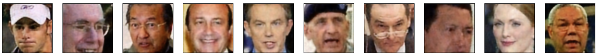

# 🧠✨ Denoiser Autoencoder and Object Detection with YOLO 🚀

This repository contains implementations of key computer vision concepts: a denoiser autoencoder for image restoration and object detection using YOLOv8. It also includes an exploration of word2vec and BLEU score in captioning models.

## 📂 Project Overview

1. **Denoiser Autoencoder**:
   - Dataset split: 80% training, 20% testing.
   - Added Gaussian noise to training images.
   - Built and trained an autoencoder using Keras.
   - Loss function: Mean Squared Error (MSE), Optimizer: Adam.
   - Achieved effective noise removal on test images.

2. **YOLOv8 Object Detection**:
   - Created ground truth bounding boxes using OpenCV.
   - Evaluated performance with Mean Average Precision (mAP).
   - Thresholds: IoU@0.5:0.05:0.95.
   - mAP achieved: **0.34**.

3. **Captioning with Word2Vec**:
   - Used word2vec embeddings to optimize the captioning model.
   - Evaluated with BLEU scores for text similarity.

---

## 🚀 Features

- 🖼️ **Denoising Images**: Removes noise effectively using autoencoders.
- 📦 **Object Detection**: Detects and evaluates bounding boxes with YOLOv8.
- 📝 **Text Embeddings**: Fine-tuned word2vec for improved model performance.
- 📊 **Evaluation Metrics**:
  - Intersection over Union (IoU).
  - Precision, Recall, and mAP.
  - BLEU scores for caption quality.

---

## 🛠️ Technologies Used

- **Programming**: Python 🐍
- **Libraries**:
  - TensorFlow/Keras for building autoencoders.
  - OpenCV for image processing.
  - NumPy for numerical operations.
- **YOLOv8** for object detection.
- **Word2Vec** for embedding representations.
- Google Colab for experimentation.

---

## 📈 Key Results

1. **Denoising Autoencoder**:
   - Trained for 50 epochs.
   - Effective noise reduction demonstrated on test images.

2. **Object Detection**:
   - mAP@0.5:0.05:0.95: **0.34**.
   - Improved bounding box predictions with increasing IoU thresholds.

3. **Captioning Evaluation**:
   - BLEU score calculated using n-grams and brevity penalty.
   - Sensitivity to target text highlighted as a limitation.

---

## 📸 Sample Outputs

### 🔹 Denoising Autoencoder:
| Noisy Input | Denoised Output |
|-------------|-----------------|
|  |  |

### 🔹 Object Detection:
| Image | Ground Truth | Prediction |
|-------|--------------|------------|
|  | Red Bounding Boxes | Yellow Bounding Boxes |

---

## 🧑‍💻 How to Run

1. Clone the repository:
   ```bash
   git clone https://github.com/yourusername/denoiser-autoencoder-yolo.git
   ```
2. Install dependencies:
   ```bash
   pip install -r requirements.txt
   ```
3. Open and run the notebook in Google Colab or locally.

---

## 📝 Citation

If you use this repository, please cite the following:
```text
Omer Kamal Ali Ebead, "Denoiser Autoencoder and Object Detection with YOLO"
```

---

## 📬 Contact

For questions or suggestions:
- Author: **Omer Kamal Ali Ebead**
- Email: [omer@aims.ac.za](mailto:omer@aims.ac.za)

---

